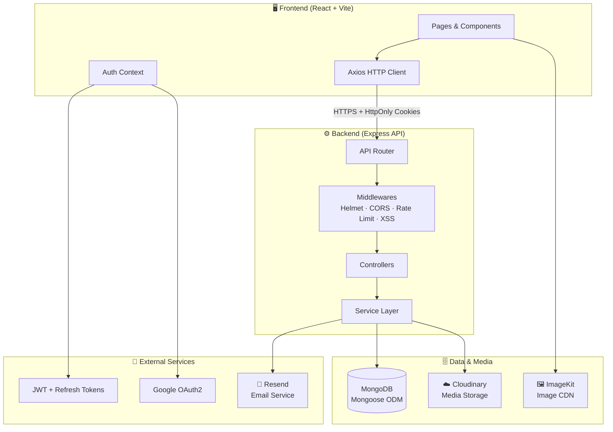

<div align="center">

<p align="center">
  
</p>

<h1 align="center">Unideals</h1>

<p>
  <a href="#"></a>
  <a href="#"></a>
  <a href="#"></a>
  <a href="#"></a>
  <a href="#"></a>
  <a href="#"></a>
</p>

<p>
  <a href="#"></a>
  <a href="#"></a>
  <a href="#"></a>
  <a href="#"></a>
</p>

<br/>

**Unideals** is a full-stack student marketplace built for buying, selling, and discovering products within your campus community — fast, secure, and beautifully designed.

</div>

## 📋 Table of Contents

- [Overview](#-overview)
- [Tech Stack](#-tech-stack)
- [Project Structure](#-project-structure)
- [System Architecture](#-system-architecture)
- [API Reference](#-api-reference)
- [Frontend Routes](#-frontend-routes)
- [Environment Variables](#-environment-variables)
- [Getting Started](#-getting-started)
- [Security](#-security)
- [License](#-license)

## 🌟 Overview

Unideals is a purpose-built marketplace platform connecting students within a campus ecosystem. It supports real-time product listings, wishlists, order tracking, multi-provider authentication, image uploads, and a notification system — all packed into a clean monorepo.

**Key highlights:**

- 🔐 **Dual auth flows** — JWT-based local auth + Google OAuth2
- 📦 **Full product lifecycle** — list, browse, filter by category/price, report
- 💬 **In-app chat & notifications** — real-time user-to-user interaction
- 🖼️ **Optimized media** — ImageKit + Cloudinary integration
- 🛡️ **Security-first** — Helmet, CORS, XSS filtering, rate limiting


## 🛠️ Tech Stack

### Frontend

| Technology | Purpose |
|---|---|
| **React 18** | UI framework with hooks-based architecture |
| **Vite** | Lightning-fast dev server & bundler |
| **React Router v6** | Client-side routing & protected routes |
| **Axios** | HTTP client with interceptors |
| **Tailwind CSS** | Utility-first styling |
| **ImageKit** | Image optimization & delivery |

### Backend

| Technology | Purpose |
|---|---|
| **Express.js** | REST API server |
| **MongoDB + Mongoose** | Document database & ODM |
| **JWT + Refresh Tokens** | Stateless authentication |
| **Zod** | Runtime schema validation |
| **Resend** | Transactional email delivery |
| **Cloudinary** | Cloud media storage |
| **Google OAuth2** | Social authentication |


## 📁 Project Structure

```
campus-mart/
├── frontend/                   # React + Vite client
│   ├── src/
│   │   ├── components/         # Reusable UI components
│   │   ├── pages/              # Route-level page components
│   │   ├── hooks/              # Custom React hooks
│   │   ├── context/            # Global state (auth, cart, etc.)
│   │   ├── services/           # Axios API calls
│   │   └── utils/              # Helpers & constants
│   ├── public/
│   ├── index.html
│   └── vite.config.js
│
├── backend/                    # Express + MongoDB API
│   ├── src/
│   │   ├── controllers/        # Route handler logic
│   │   ├── models/             # Mongoose schemas
│   │   ├── routes/             # API route definitions
│   │   ├── middlewares/        # Auth, validation, error handling
│   │   ├── services/           # Business logic layer
│   │   └── utils/              # Shared utilities
│   ├── .env.sample
│   └── server.js
│
├── .gitignore
└── README.md
```


## 🏗️ System Architecture




## 📡 API Reference

All API routes are prefixed with the base URL configured via `VITE_API_BASE_URL`.

### Auth — `/api/auth`

| Method | Endpoint | Description | Access |
|---|---|---|---|
| `POST` | `/register` | Create new account | Public |
| `POST` | `/login` | Local login | Public |
| `POST` | `/logout` | Invalidate session | Protected |
| `POST` | `/refresh-token` | Rotate access token | Public |
| `POST` | `/forgot-password` | Send reset email | Public |
| `POST` | `/reset-password/:token` | Reset user password | Public |
| `POST` | `/verify-email` | Verify email address | Public |
| `GET` | `/google` | Initiate Google OAuth | Public |
| `GET` | `/google/callback` | OAuth callback handler | Public |

### User — `/api/user` 🔒

| Method | Endpoint | Description |
|---|---|---|
| `GET` | `/profile` | Get authenticated user |
| `PUT` | `/profile` | Update profile details |
| `GET` | `/orders` | Fetch user orders |

### Product — `/api/product`

| Method | Endpoint | Description | Access |
|---|---|---|---|
| `GET` | `/` | List all products | Public |
| `GET` | `/:id` | Get product by ID | Public |
| `GET` | `/category/:name` | Filter by category | Public |
| `POST` | `/` | Create product listing | Protected |
| `PUT` | `/:id` | Update a listing | Protected |
| `DELETE` | `/:id` | Remove a listing | Protected |

### Other Protected Routes

| Group | Base Path | Description |
|---|---|---|
| **Wishlist** | `/api/wishlist` | Save & manage favourite listings |
| **Address** | `/api/address` | User address management |
| **Report** | `/api/report` | Flag inappropriate listings |
| **ImageKit** | `/api/imagekit` | Signed upload tokens |
| **Health** | `/health` | Server health check |


## 🗺️ Frontend Routes

### Public Routes

```
/                          → Home / Product feed
/product/:id               → Product detail page
/category/:categoryName    → Category browser
/price                     → Price range filter view
```

### Auth Routes

```
/login                     → Sign in
/signup                    → Create account
/forgot-password           → Request password reset
/reset-password/:token     → Set new password
/verify-email              → Email verification gate
/checkEmail                → Post-signup confirmation prompt
```

### Protected Routes 🔒

```
/profile                   → User profile & settings
/wishlist                  → Saved listings
/myorders                  → Order history
/chat                      → Messaging centre
/notification              → Activity notifications
/upload                    → Create a new listing
/contact                   → Contact support
/termscondition            → Terms & conditions
```


## 🔧 Environment Variables

### Backend — `backend/.env`

```env
# Server
PORT=5000
NODE_ENV=development
FRONTEND_URL=http://localhost:5173

# Database
MONGO_URL=mongodb+srv://<user>:<password>@cluster.mongodb.net/campus-mart

# Authentication
SECRET_KEY_ACCESS_TOKEN=your_access_token_secret
SECRET_KEY_REFRESH_TOKEN=your_refresh_token_secret

# Google OAuth
GOOGLE_CLIENT_ID=your_google_client_id
GOOGLE_CLIENT_SECRET=your_google_client_secret
GOOGLE_REDIRECT_URI=http://localhost:5000/api/auth/google/callback

# Cloudinary
CLOUDINARY_CLOUD_NAME=your_cloud_name
CLOUDINARY_API_KEY=your_api_key
CLOUDINARY_API_SECRET=your_api_secret

# Email
RESEND_API_KEY=your_resend_api_key
```

### Frontend — `frontend/.env`

```env
VITE_API_BASE_URL=http://localhost:5000
VITE_IMAGEKIT_PUBLIC_KEY=your_imagekit_public_key
VITE_IMAGEKIT_URL_ENDPOINT=https://ik.imagekit.io/your_id
```

> ⚠️ **Never commit `.env` files.** Use `.env.sample` files as templates and add `.env` to `.gitignore`.

## 🚀 Getting Started

### Prerequisites

- **Node.js** ≥ 18.0.0
- **npm** ≥ 9.0.0
- **MongoDB** instance (local or Atlas)
- Accounts for: Cloudinary, Resend, ImageKit, Google Cloud Console

### 1 · Clone the repository

```bash
git clone https://github.com/your-username/campus-mart.git
cd campus-mart
```

### 2 · Set up the backend

```bash
cd backend
cp .env.sample .env        # Fill in your environment variables
npm install
npm run dev                # Starts on http://localhost:5000
```

### 3 · Set up the frontend

```bash
cd ../frontend
cp .env.sample .env        # Fill in your environment variables
npm install
npm run dev                # Starts on http://localhost:5173
```

### 4 · Open in your browser

```
Frontend  →  http://localhost:5173
API Health  →  http://localhost:5000/health
```


## 🛡️ Security

Unideals is built with a layered security model:

| Layer | Implementation |
|---|---|
| **Transport** | HTTPS-only in production; CORS restricted to frontend origin |
| **Authentication** | Short-lived JWTs + HttpOnly refresh token cookies |
| **Authorization** | Route-level middleware guards on all protected endpoints |
| **Input validation** | Zod schemas on all incoming request bodies |
| **XSS protection** | XSS-filters applied at middleware level |
| **Rate limiting** | Per-IP request throttling on auth & public routes |
| **HTTP hardening** | Helmet sets secure response headers |
| **Media** | Signed ImageKit upload tokens; server-side Cloudinary keys |


## 📄 License

Distributed under the **ISC License**. See [`LICENSE`](./LICENSE) for more information.

<div align="center">


<p>Built with ❤️ for campus communities everywhere by <b><a href="https://imaginumorg.vercel.app/">Team Imaginum</a></b></p>

<p>
  <a href="#">⬆ Back to top</a>
</p>

</div>