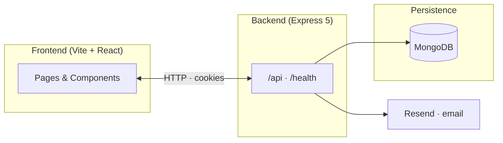

<div align="center">

# Campus Mart

### Campus marketplace · full-stack monorepo

**React · Vite · Express · MongoDB**

<br />

[](https://nodejs.org/)
[](https://react.dev/)
[](https://vitejs.dev/)
[](https://expressjs.com/)
[](https://www.mongodb.com/)

<br />

[Overview](#overview) ·
[Architecture](#architecture) ·
[Stack](#tech-stack) ·
[Setup](#getting-started) ·
[API](#http-api) ·
[Frontend routes](#frontend-routes) ·
[Scripts](#npm-scripts)

<br />

</div>

---

## Overview

**Campus Mart** is a monorepo for a campus-oriented marketplace: a **React (Vite)** web client and a **Node.js (Express)** API backed by **MongoDB**.

| Package | Path | Role |
|:--------|:-----|:-----|
| **Web client** | [`frontend/`](frontend/) | React SPA, Tailwind CSS, client-side routing |
| **API** | [`backend/`](backend/) | REST API, MongoDB, JWT (`accessToken` cookie or `Authorization` bearer) |

**Today’s backend** covers **authentication**, **email verification** and **password reset** (transactional email via [Resend](https://resend.com/)), plus **authenticated user profile** actions. A **Mongoose `Product` model** exists for future product APIs; listing and related UI are **not** connected to product HTTP routes in the server code yet.

> **Note:** Product-related pages in the client are ahead of the current API surface. Treat the backend sections below as the source of truth for what is implemented server-side.

---

## Architecture



---

## Tech stack

<details>
<summary><strong>Frontend</strong> — see <code>frontend/package.json</code></summary>

<br />

| Category | Packages |
|:---------|:---------|
| **Core** | React 18, Vite 6, React Router 7 |
| **Styling** | Tailwind CSS 3, PostCSS, Autoprefixer |
| **HTTP** | Axios — base URL in [`src/Common/SummaryApi.js`](frontend/src/Common/SummaryApi.js) |
| **UI & motion** | Framer Motion, Swiper, Radix UI, Heroicons, Lucide React, React Icons |
| **Forms & inputs** | react-datepicker, react-select, react-slider |
| **Other** | `firebase` (dependency; optional `VITE_FIREBASE_*` in `frontend/.env.sample`), **EmailJS** for the protected Contact form ([`ContactUs.jsx`](frontend/src/Pages/ContactUs.jsx)) |
| **Tooling** | ESLint 9, React TS types |

</details>

<details>
<summary><strong>Backend</strong> — see <code>backend/package.json</code></summary>

<br />

| Category | Packages |
|:---------|:---------|
| **Runtime** | Node.js (ES modules), Express 5 |
| **Data** | Mongoose 9 → MongoDB |
| **Auth** | jsonwebtoken, bcrypt |
| **Email** | Resend ([`src/config/sendEmail.js`](backend/src/config/sendEmail.js)) |
| **HTTP hardening** | Helmet, CORS, cookie-parser, morgan, dotenv |

</details>

---

## Prerequisites

- **Node.js** 18+ (recommended)
- **MongoDB** (local or hosted URI)
- **Resend** API key for verification and password-reset emails

---

## Environment variables

### Backend

Copy [`backend/.env.sample`](backend/.env.sample) → `backend/.env`. Variables **used under** `backend/src/`:

| Variable | Purpose |
|:---------|:--------|
| `PORT` | HTTP port (defaults to `5000` in [`server.js`](backend/server.js) if unset) |
| `FRONTEND_URL` | CORS origin; links in verification and reset emails |
| `MONGO_URL` | MongoDB connection string |
| `SECRET_KEY_ACCESS_TOKEN` | Sign / verify JWTs ([`auth.middleware.js`](backend/src/middlewares/auth.middleware.js), token helpers) |
| `RESEND_API_KEY` | Required for [`sendEmail.js`](backend/src/config/sendEmail.js) |
| `NODE_ENV` | e.g. `development` / `production` (cookies, logging) |

The sample file may also list `JWT_SECRET`, `SECRET_KEY_REFERECE_TOKEN`, and `CLOUDINARY_*` — **these are not read** by the current `src/` code; keep them only for future work or deployment templates.

### Frontend

Copy [`frontend/.env.sample`](frontend/.env.sample) → `frontend/.env`.

| Variable | Purpose |
|:---------|:--------|
| `VITE_SERVICE_ID`, `VITE_TEMPLATE_ID`, `VITE_PUBLIC_KEY` | EmailJS on the Contact page |
| `VITE_FIREBASE_*`, `VITE_ENABLE_ANALYTICS`, `VITE_API_URL` | Present in the sample; auth calls currently use the base URL in [`SummaryApi.js`](frontend/src/Common/SummaryApi.js) (`http://localhost:5000`) |

---

## Getting started

<table>
<tr>
<td width="50%" valign="top">

**1 · Install**

```bash
cd backend && npm install
cd ../frontend && npm install
```

**2 · Env**

Copy and fill `backend/.env` and `frontend/.env` (see above).

</td>
<td width="50%" valign="top">

**3 · API**

```bash
cd backend
npm run dev
```

`GET /health` → status, uptime, timestamp.

**4 · Client**

```bash
cd frontend
npm run dev
```

Default Vite port **5173**; [`vite.config.js`](frontend/vite.config.js) sets `server.host: true`.

</td>
</tr>
</table>

---

## HTTP API

Application routes are under **`/api`**.

| Prefix | Scope |
|:-------|:------|
| [`/api/auth`](backend/src/routes/auth.routes.js) | Register, login, verify email, logout, forgot / reset password |
| [`/api/user`](backend/src/routes/user.routes.js) | Profile, delete account (authenticated) |

### Auth — `POST/GET` [`/api/auth`](backend/src/routes/auth.routes.js)

| | Path | Purpose |
|:--|:-----|:--------|
| `POST` | `/register` | Register; sends verification email |
| `POST` | `/login` | Login; sets cookies |
| `POST` | `/verify-email` | Complete verification |
| `GET` | `/logoutUser` | Logout |
| `POST` | `/forgot-password` | Start reset |
| `GET` | `/reset-password/:token` | Validate token |
| `POST` | `/reset-password/:token` | Set new password |

### User — [`/api/user`](backend/src/routes/user.routes.js)

| Method | Path | Auth | Purpose |
|:-------|:-----|:----:|:--------|
| `GET` | `/userProfile` | Yes | Current user |
| `DELETE` | `/deleteAccount` | Yes | Delete account |

Protected routes: JWT from **`accessToken` cookie** or **`Authorization: Bearer <token>`** ([`auth.middleware.js`](backend/src/middlewares/auth.middleware.js)).

---

## Frontend routes

Defined in [`src/App.jsx`](frontend/src/App.jsx).

**Public:** `/`, `/login`, `/signup`, `/checkEmail`, `/forgot-password`, `/reset-password/:token`

**Protected** (`ProtectedRoute`): `/profile`, `/notification`, `/myorders`, `/wishlist`, `/productlisted`, `/termscondition`, `/contact`, `/product`, `/upload`, `/price`, `/chat`, `/category/:categoryName`

Catch-all → redirect to `/`.

---

## NPM scripts

| | Frontend | Backend |
|:--|:---------|:--------|
| **Dev** | `npm run dev` | `npm run dev` → `nodemon server.js` |
| **Prod** | `npm run build` · `npm run preview` | `npm start` → `node server.js` |
| **Quality** | `npm run lint` | `npm test` — placeholder (fails if run) |

---

## Security (as implemented)

| Measure | Detail |
|:--------|:-------|
| Passwords | **bcrypt** on register / reset |
| Transport & headers | **Helmet**; JSON body limit **10kb** in [`app.js`](backend/src/app.js) |
| Origin | **CORS** to `FRONTEND_URL`, `credentials: true` |
| Sessions / tokens | JWT verified from cookie or bearer header |

---

## Project structure

```
Campus Mart/
├── frontend/
│   ├── src/
│   │   ├── App.jsx
│   │   ├── main.jsx
│   │   ├── index.css
│   │   ├── Common/          # API paths & base URL (SummaryApi.js)
│   │   ├── Components/
│   │   ├── Pages/
│   │   ├── Utils/           # Axios instance
│   │   └── assets/
│   ├── vite.config.js
│   └── package.json
│
├── backend/
│   ├── server.js
│   ├── package.json
│   └── src/
│       ├── app.js
│       ├── config/
│       ├── controllers/
│       ├── middlewares/
│       ├── models/          # User, Product (no product routes yet)
│       ├── routes/
│       └── utils/
│
└── Readme.md
```

---

## License

Backend [`package.json`](backend/package.json) declares **ISC**. There is no root `LICENSE` file; confirm terms with your team or legal policy.

---

<div align="center">

**Campus Mart** · Built for campus communities

<br />

</div>
